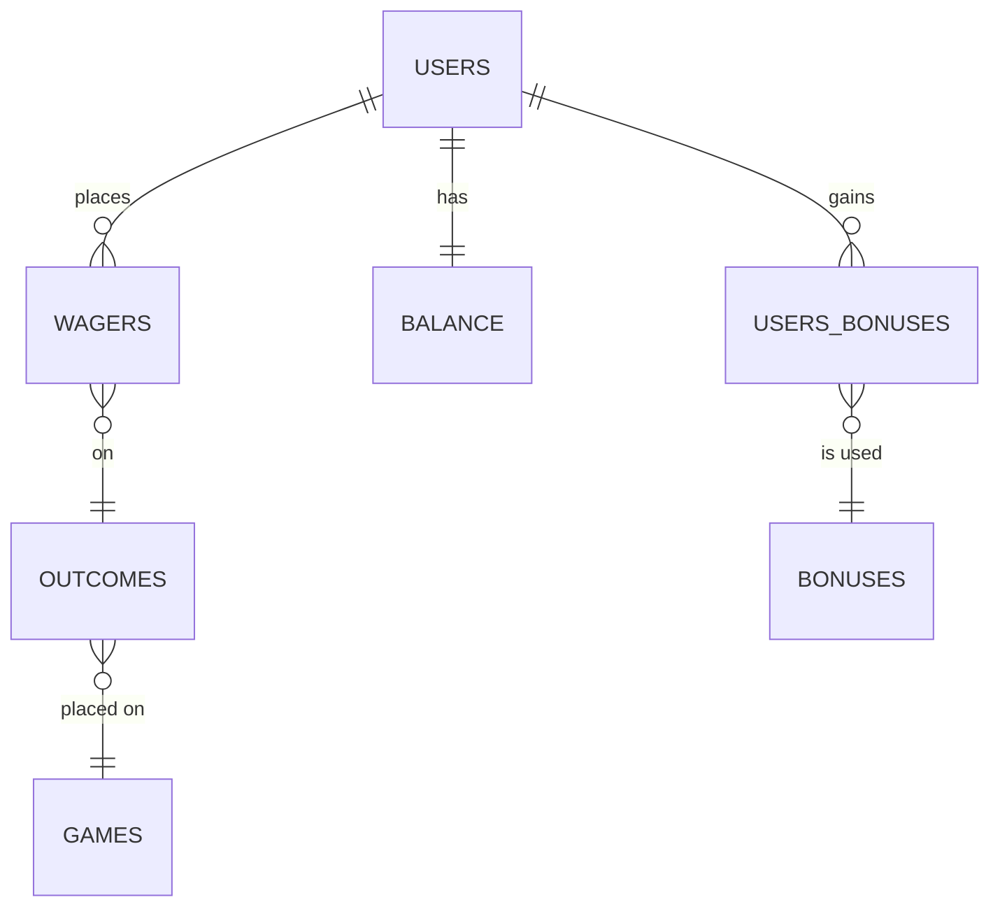

# Uecker-bot
Relaying all the scores and data you can shake a Mendoza line bat at

"I count hits, walks, fielder’s choice, everything. If I hit it good, I count it. By my own system, I batted .643." -Bob Uecker

# MLB Battlegrounds
[Design Document](https://docs.google.com/document/d/1S3uQrraa4uiAM9_QRo4JQJQQv2qH9dgt_Lg5MEOMA7Y/edit)

## Functional View

|Command   | Pseudo Logic  | 
|---|---|
|`/balance`   | READ balance  |
| `/wager` [x] [team]  | READ `outcomes` where valid<br/>READ `balances` for `users` and check if > `x`<br/>CREATE record for `wagers`<br/>UPDATE `balances`   |
|  `/results` | READ `wagers` for `users`.`id` where `outcomes`.`date` is today and display `games`.`result` |
| `/results` [week/month/season] | As above, with extra factor of `outcomes`.`week` == this week OR `outcomes`.`season` == this season |
| `/bonus` | READ `users_bonuses` where `user_id` is me and status is active |
| `/use [x]` | READ `users_bonuses` and confirm they have `x`<br/> APPLY `bonus` to appropriate outcome (balance/wagers/other players etc.) <br/> UPDATE `users_bonuses`.`status` to decrement by 1 (allowing multi-use bonuses) |
| `/games` | READ `games` where date is today |

### Problem Spaces
- How to determine timey stuff:
    - "today"
    - Determine "this week"
    - Determine "this season"
- Schedule that updates results
    - results for a given game (scheduled job?) (outcomes are resulted)
    - update balance given a result (should be part of above job... python? SQL? print and pencil?)
- Bonuses
    - Daily job to award "winner(s)" for a given day
    - Job to then look at "streaks" of wagers and/or wins
    - How to apply bonuses? Probably just need to program them - can't think of a way to abstract to database, given they vary in effects
- Balances
    - Managing this? Better to calc each time or have a table which has the current number at all times, which can be reconciled in a daily job?
- Edge cases
    - Delays? Daily job held back until "resulted"? Or plow ahead and disregard from "today"
    - Suspended?
    - Doubleheaders - cater for this using the `outcomes.


## Database Schema


## SQLAlchemy Schema
```python
class Game(Base):
    """
    Available games to be wagered upon, and other metadata
    """

    __tablename__ = "games"
    id = db.Column(db.Integer, primary_key=True)
    home_team = db.Column(db.String(128))
    away_team = db.Column(db.String(128))
    date = db.Column(db.Date)
    season = db.Column(db.Integer)
    week = db.Column(db.Integer)
    dh = db.Column(db.Integer)


class Outcome(Base):
    """
    A list of `outcome` which are `wagered` on. This will be filled by the schedules API (or some other mechanism)
    """

    __tablename__ = "outcomes"
    id = db.Column(db.Integer, primary_key=True)
    selection_name = db.Column(db.String)
    outcome_date = db.Column(db.Date)
    game_id = db.Column(db.Integer, db.ForeignKey("games.id"))
    result = db.Column(db.Integer)


class Wager(Base):
    """
    A given `user` makes a `wager`... this is then checked against the outcome to determine results
    """

    __tablename__ = "wagers"
    id = db.Column(db.Integer, primary_key=True)
    user_id = db.Column(db.Integer, db.ForeignKey("users.id"), primary_key=True)
    wager_amount = db.Column(db.Integer)
    outcome_id = db.Column(db.Integer, db.ForeignKey("games.id"))


class User(Base):
    """
    Base table for a given individual, mapping to their discord user id
    """

    __tablename__ = "users"

    id = db.Column(db.Integer, primary_key=True)
    discord_id = db.Column(db.String(255))


class Balance(Base):
    """
    A table which tracks the current balance of a given user
    """

    __tablename__ = "balances"

    user_id = db.Column(db.Integer, db.ForeignKey("users.id"), primary_key=True)
    balance_amount = db.Column(db.BigInteger)


class Bonus(Base):
    """
    A list of the universe of bonuses available for users to have
    """

    __tablename__ = "bonuses"

    id = db.Column(db.Integer, primary_key=True)
    bonus_name = db.Column(db.String(255))


class UserBonus(Base):
    """
    The bonuses applied to a given user and when that bonus will be applied
    """

    __tablename__ = "users_bonuses"

    id = db.Column(db.Integer, primary_key=True)
    user_id = db.Column(db.Integer, db.ForeignKey("users.id"))
    bonus_id = db.Column(db.Integer, db.ForeignKey("bonuses.id"))
    status = db.Column(db.Integer)
    efft_d = db.Column(db.DateTime)
    expy_d = db.Column(db.DateTime)
```